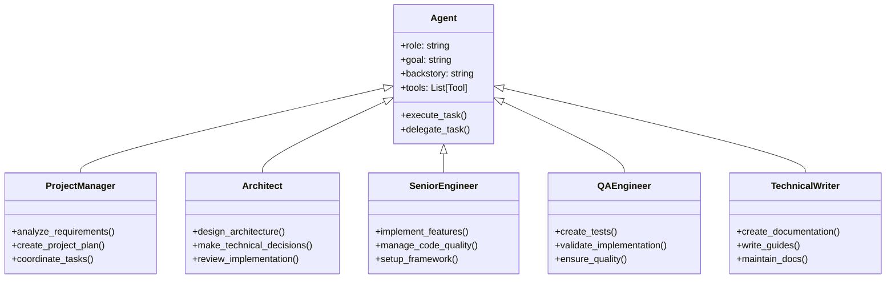
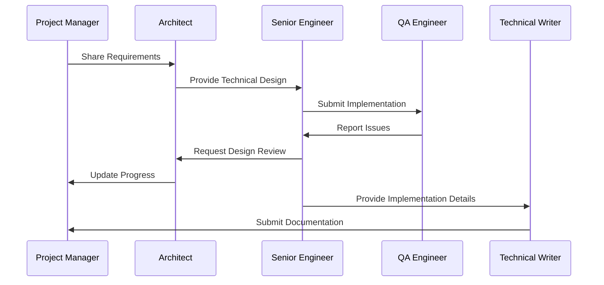

# AI Agents Architecture

## Agent System Overview

DevCrew's AI agent system is built on specialized agents, each with defined roles and responsibilities in the software development lifecycle.



## Agent Roles & Responsibilities

### Project Manager Agent

The Project Manager agent is responsible for overall project coordination and planning.

**Key Responsibilities:**
- Analyzing project requirements
- Creating detailed project plans
- Coordinating between other agents
- Monitoring project progress
- Managing project timeline
- Ensuring requirement fulfillment

**Tools:**
- SerperDev for research
- File system tools for project management
- Requirements analysis tools

### Architect Agent

The Architect agent handles system design and technical decision-making.

**Key Responsibilities:**
- Designing system architecture
- Making technology stack decisions
- Creating technical specifications
- Reviewing implementations
- Ensuring scalability
- Maintaining technical standards

**Tools:**
- Architecture design tools
- Technical documentation tools
- Code review tools

### Senior Engineer Agent

The Senior Engineer agent handles implementation and code quality.

**Key Responsibilities:**
- Implementing core functionality
- Managing code quality
- Setting up frameworks
- Following best practices
- Optimizing performance
- Handling technical debt

**Tools:**
- Framework tools
- Implementation tools
- Shell command execution
- Code generation tools

### QA Engineer Agent

The QA Engineer agent ensures quality and proper testing.

**Key Responsibilities:**
- Creating test suites
- Validating implementations
- Ensuring code coverage
- Performance testing
- Security testing
- Maintaining quality standards

**Tools:**
- Testing frameworks
- Validation tools
- Quality assurance tools

### Technical Writer Agent

The Technical Writer agent handles all documentation needs.

**Key Responsibilities:**
- Creating technical documentation
- Writing user guides
- Maintaining API documentation
- Creating tutorials
- Updating documentation
- Ensuring documentation quality

**Tools:**
- Documentation generators
- File system tools
- Markdown processors

## Agent Interaction Model



## Agent Configuration

Each agent is configured with specific parameters:

```python
{
    "role": "Agent Role",
    "goal": "Primary Objective",
    "backstory": "Agent Background",
    "verbose": true,
    "allow_delegation": true,
    "tools": [
        "List of available tools"
    ]
}
```

## Agent Communication

Agents communicate through a structured message system:

```python
{
    "from_agent": "Sender Agent",
    "to_agent": "Receiver Agent",
    "message_type": "Type of message",
    "content": "Message content",
    "metadata": {
        "priority": "Priority level",
        "timestamp": "Message timestamp",
        "context": "Additional context"
    }
}
```

## Agent Decision Making

Agents follow a structured decision-making process:

1. **Input Analysis**
   - Context evaluation
   - Requirement analysis
   - Resource assessment

2. **Task Planning**
   - Step identification
   - Resource allocation
   - Timeline planning

3. **Execution**
   - Task implementation
   - Progress monitoring
   - Quality checks

4. **Review & Optimization**
   - Result validation
   - Performance analysis
   - Improvement identification

## Agent Learning & Improvement

While agents don't learn during runtime, they are designed to:

1. **Follow Best Practices**
   - Industry standards
   - Coding conventions
   - Documentation practices

2. **Use Patterns**
   - Design patterns
   - Implementation patterns
   - Testing patterns

3. **Optimize Processes**
   - Workflow improvements
   - Resource optimization
   - Quality enhancements

## Future Agent Enhancements

Planned improvements for the agent system:

1. **Enhanced Capabilities**
   - Better decision making
   - Improved coordination
   - Advanced problem solving

2. **Additional Roles**
   - DevOps specialist
   - Security expert
   - Performance engineer

3. **Tool Integration**
   - More development tools
   - Advanced analysis tools
   - Enhanced automation