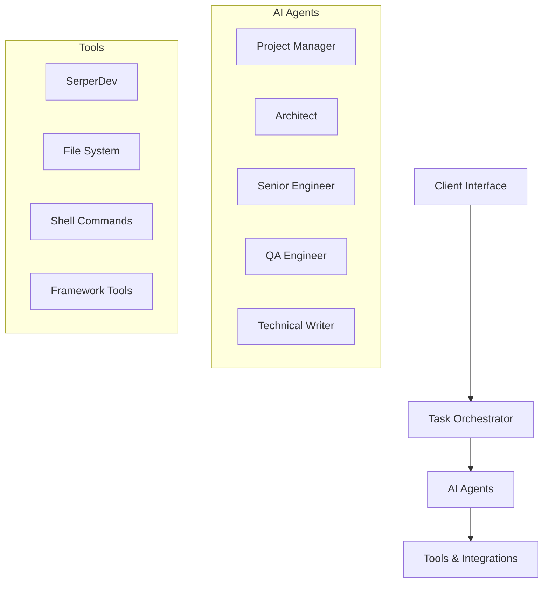
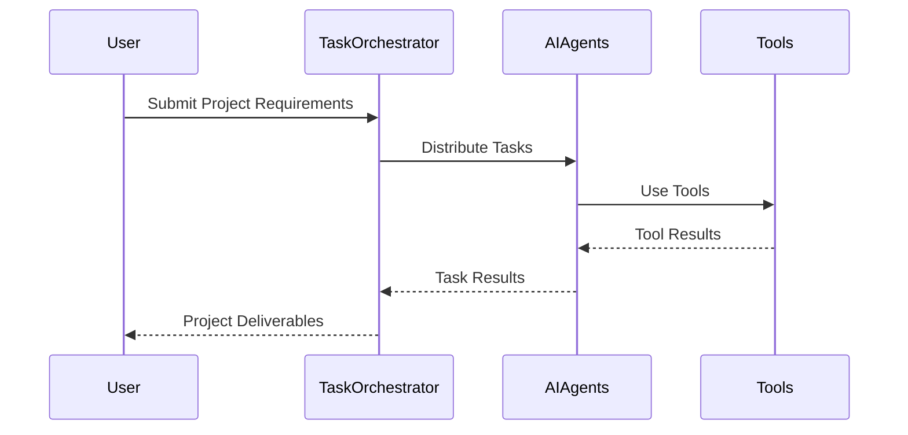

# DevCrew Architecture Overview

## System Architecture

DevCrew implements a sophisticated architecture built around AI agents and automation tools. The system is designed to be modular, extensible, and framework-agnostic.



## Core Components

### 1. Task Orchestrator

The task orchestrator manages the workflow between different AI agents and ensures proper sequencing of development tasks:

- Requirements analysis
- Architecture design
- Implementation
- Testing
- Documentation

### 2. AI Agents System

Each agent is specialized for specific tasks in the development lifecycle:

- **Project Manager**: Coordinates activities and manages requirements
- **Architect**: Designs system architecture and makes technical decisions
- **Senior Engineer**: Implements core functionality and manages code
- **QA Engineer**: Handles testing and quality assurance
- **Technical Writer**: Creates and maintains documentation

### 3. Tools Integration

DevCrew integrates various tools to support development:

- SerperDev for research and information gathering
- File system management for project organization
- Shell command execution for development tasks
- Framework-specific tools for project setup

## Project Structure

```
dev_crew/
├── src/
│   ├── dev_crew/
│   │   ├── api/
│   │   ├── config/
│   │   ├── tools/
│   │   ├── utils/
│   │   ├── crew.py
│   │   └── main.py
├── docs/
├── tests/
└── workspace/
```

## Data Flow



## System Integration

DevCrew integrates with various external services and tools:

1. **OpenAI Integration**
   - GPT-4 for natural language processing
   - Code generation and analysis
   - Documentation creation

2. **Development Tools**
   - Version control systems
   - Package managers
   - Build tools
   - Testing frameworks

3. **Framework Integration**
   - Next.js setup and configuration
   - FastAPI integration
   - Database tools
   - Testing frameworks

## Security Architecture

DevCrew implements several security measures:

1. **Authentication & Authorization**
   - API key management
   - Access control
   - Secure configuration

2. **Data Security**
   - Secure file system operations
   - Environment variable protection
   - Secrets management

3. **Code Security**
   - Secure coding practices
   - Dependency scanning
   - Code analysis

## Scalability & Performance

The system is designed for scalability:

1. **Horizontal Scaling**
   - Containerized deployment
   - Load balancing
   - Distributed processing

2. **Performance Optimization**
   - Caching mechanisms
   - Efficient resource utilization
   - Optimized processing

3. **Resource Management**
   - Task queuing
   - Resource allocation
   - Process monitoring

## Error Handling & Recovery

Robust error handling mechanisms:

1. **Error Detection**
   - Input validation
   - Process monitoring
   - Status checking

2. **Recovery Procedures**
   - Automatic retry mechanisms
   - Fallback procedures
   - State recovery

3. **Logging & Monitoring**
   - Error logging
   - Performance monitoring
   - System metrics

## Future Architecture Considerations

Planned architectural improvements:

1. **Enhanced AI Capabilities**
   - Advanced code generation
   - Improved decision making
   - Better context understanding

2. **Additional Integrations**
   - More framework support
   - Additional tool integration
   - Extended API capabilities

3. **Performance Enhancements**
   - Improved processing speed
   - Better resource utilization
   - Enhanced scalability