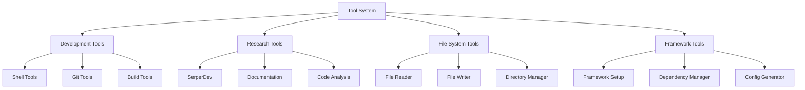

# Tools and Integration

## Tool System Overview

DevCrew integrates various tools to support the AI agents in their tasks. These tools are organized into categories and provide specific functionality for different aspects of the development process.



## Core Tool Categories

### 1. Development Tools

Development tools handle code-related operations and project setup.

#### Shell Tool
```python
class ShellTool(BaseTool):
    """Execute shell commands safely"""
    
    def _run(self, command: str) -> str:
        """Execute a shell command
        
        Args:
            command: Shell command to execute
            
        Returns:
            Command output
        """
        # Implementation details
```

#### Framework Tool
```python
class FrameworkTool(BaseTool):
    """Handle framework-specific operations"""
    
    def _run(self, project_dir: str, config_path: str) -> dict:
        """Set up framework environment
        
        Args:
            project_dir: Project directory path
            config_path: Configuration file path
            
        Returns:
            Setup results and status
        """
        # Implementation details
```

#### Implementation Tool
```python
class ImplementationTool(BaseTool):
    """Manage code implementation tasks"""
    
    def _run(self, task: dict, context: dict) -> dict:
        """Execute implementation tasks
        
        Args:
            task: Implementation task details
            context: Task context and requirements
            
        Returns:
            Implementation results
        """
        # Implementation details
```

### 2. Research Tools

Tools for gathering information and analyzing requirements.

#### SerperDev Tool
```python
class SerperDevTool(BaseTool):
    """Interface with SerperDev API"""
    
    def _run(self, query: str) -> dict:
        """Execute search query
        
        Args:
            query: Search query string
            
        Returns:
            Search results
        """
        # Implementation details
```

### 3. File System Tools

Tools for managing project files and directories.

#### File Reader Tool
```python
class FileReadTool(BaseTool):
    """Read and parse files"""
    
    def _run(self, file_path: str) -> str:
        """Read file contents
        
        Args:
            file_path: Path to file
            
        Returns:
            File contents
        """
        # Implementation details
```

#### File Writer Tool
```python
class FileWriterTool(BaseTool):
    """Write and update files"""
    
    def _run(self, file_path: str, content: str) -> bool:
        """Write content to file
        
        Args:
            file_path: Path to file
            content: Content to write
            
        Returns:
            Success status
        """
        # Implementation details
```

## Tool Integration System

### Tool Registration

Tools are registered with the system using a decorator pattern:

```python
@tool
class CustomTool(BaseTool):
    """Custom tool implementation"""
    pass
```

### Tool Configuration

Tools can be configured using environment variables or configuration files:

```yaml
tools:
  serper_dev:
    api_key: ${SERPER_API_KEY}
    timeout: 30
    
  shell_tool:
    allowed_commands:
      - npm
      - git
      - python
    timeout: 60
```

### Tool Access Control

Tools implement access control through capability checking:

```python
def check_tool_access(agent: Agent, tool: BaseTool) -> bool:
    """Check if agent has access to tool
    
    Args:
        agent: Agent requesting access
        tool: Tool being accessed
        
    Returns:
        Access granted status
    """
    return tool.name in agent.allowed_tools
```

## Error Handling

Tools implement standardized error handling:

```python
class ToolError(Exception):
    """Base class for tool errors"""
    pass

class ToolExecutionError(ToolError):
    """Error during tool execution"""
    pass

class ToolConfigurationError(ToolError):
    """Error in tool configuration"""
    pass
```

## Tool Usage Patterns

### Sequential Tool Usage
```python
results = []
for tool in tools:
    result = tool.run(input_data)
    results.append(result)
```

### Parallel Tool Usage
```python
async def run_tools_parallel(tools, input_data):
    """Run tools in parallel"""
    tasks = [tool.run_async(input_data) for tool in tools]
    results = await asyncio.gather(*tasks)
    return results
```

## Tool Development Guide

### Creating New Tools

1. Inherit from BaseTool:
```python
class NewTool(BaseTool):
    """New tool implementation"""
    
    def __init__(self):
        super().__init__()
        # Tool initialization
    
    def _run(self, *args, **kwargs):
        """Tool implementation"""
        pass
```

2. Implement required methods:
- `_run`: Main tool functionality
- `validate_input`: Input validation
- `handle_errors`: Error handling

### Tool Testing

Tools should include comprehensive tests:

```python
class TestNewTool(unittest.TestCase):
    """Test cases for new tool"""
    
    def setUp(self):
        self.tool = NewTool()
    
    def test_basic_functionality(self):
        """Test basic tool functionality"""
        result = self.tool.run(test_input)
        self.assertEqual(result, expected_output)
```

## Future Tool Enhancements

Planned improvements for the tool system:

1. **Enhanced Capabilities**
   - Advanced code generation tools
   - AI-powered debugging tools
   - Automated optimization tools

2. **Integration Improvements**
   - Better tool coordination
   - Enhanced error recovery
   - Improved performance

3. **New Tool Types**
   - Security analysis tools
   - Performance profiling tools
   - Advanced testing tools