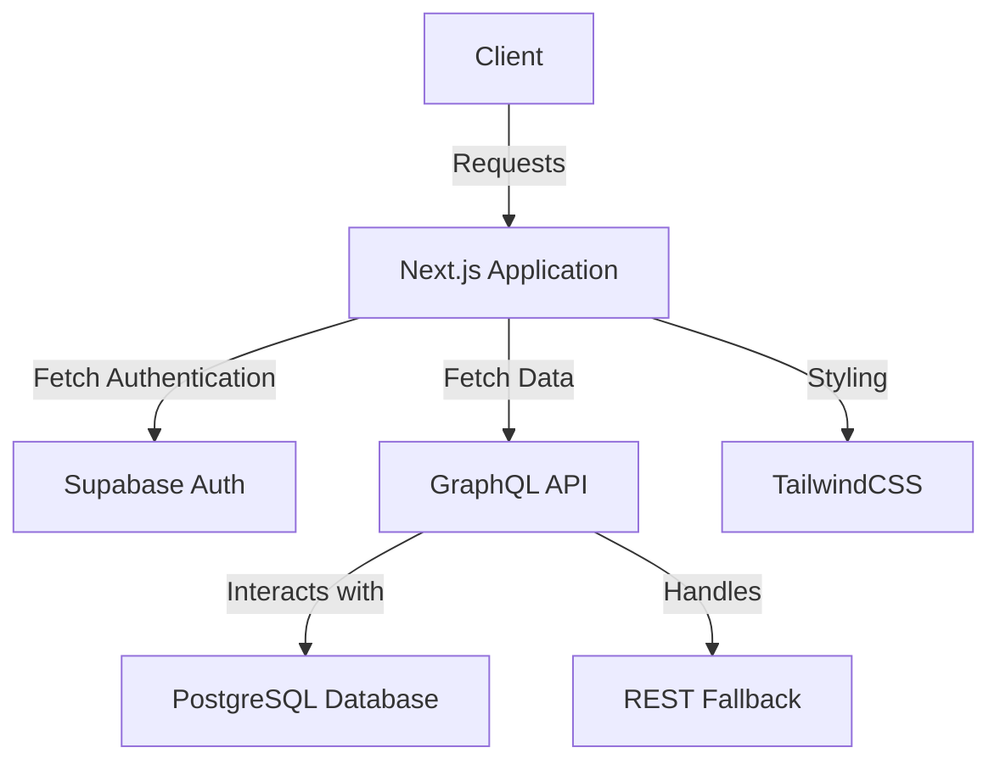

```
# System Architecture Document for Modern Web Application

## 1. System Overview

### High-level architecture diagram


### Key components and their responsibilities
- **Next.js Application**: Serves both frontend and backend functionalities, enabling server-side rendering for better SEO and performance.
- **Supabase Auth**: Manages user authentication and session management securely.
- **GraphQL API**: Provides centralized access to application data while maintaining a flexible data-fetching approach.
- **PostgreSQL Database**: Robust, relational database system that handles various data types and complex queries.
- **TailwindCSS**: Utility-first CSS framework that allows rapid UI development and ensures a consistent look and feel.

### System boundaries and external interfaces
- The application interacts with users through a web-based client, communicates with the Supabase authentication layer for secure logins, and performs CRUD operations on the PostgreSQL database via a GraphQL API.

## 2. Technology Stack

### Detailed justification for each technology choice
1. **Next.js (v15)**: Offers an optimal balance of server-side rendering and client-side interactivity, allowing enhanced loading speeds and SEO.
2. **Supabase**: Provides a full backend solution with real-time capabilities, including database and authentication services without vendor lock-in.
3. **PostgreSQL**: Chosen for its advanced features such as JSONB support, allowing for versatile data structures, essential for our use case.
4. **Drizzle ORM**: Streamlines interactions with the database by abstracting complexity and ensuring type safety.
5. **GraphQL**: Allows clients to query for precisely the data they need, minimizing the amount of transferred data and optimizing API performance.
6. **TailwindCSS**: Facilitates a responsive, mobile-first design approach that enhances user experience without sacrificing performance.
7. **TypeScript**: Enforces strict type-checking, ensuring reliability and maintainability of the application code.
8. **GitHub Actions**: Implements a sophisticated CI/CD workflow that automates testing and deployment.

### Version requirements and compatibility considerations
- **Next.js**: Latest stable version for optimal performance and features.
- **Supabase**: Should always align with the latest features for compatibility.
- **PostgreSQL**: Version 13 or above to leverage new enhancements.

### Alternative technologies considered and why they were not chosen
- **Firebase vs. Supabase**: Firebase's data model and lock-in potential were less appealing compared to the open-source nature of Supabase.
- **MySQL vs. PostgreSQL**: PostgreSQL's advanced capabilities for complex queries made it superior for our needs.

## 3. Component Architecture

### Frontend architecture (React/Next.js structure)
- The application is structured with a component-based hierarchy leading to optimized rendering. Global state management can be facilitated either through React context or libraries such as Redux or Zustand based on complexity.

### Backend services and APIs
- A GraphQL API serves requests, abstracts database access, and routes interactions with the PostgreSQL database.

### Database design and data models
- Data models are defined in Drizzle ORM, ensuring strong type safety and efficient migration strategies aligned with the application requirements.

### Authentication and authorization flow
- Users authenticate with Supabase, upon success, they receive JWT tokens to manage sessions securely.

### External service integrations
- Integration with third-party services should consider GraphQL for data aggregation and secure handling.

## 4. Data Flow

### Request/response patterns
- Clients perform requests to the GraphQL API, which interacts with the database, returning structured data accordingly.

### Data processing pipelines
- User data is processed server-side before being sent to the frontend, ensuring efficient loading times and data integrity.

### State management approach
- Depending on complexity, state management will either utilize React's context API or an external state management library.

### Caching strategy
- Apollo Client's caching capabilities will enhance performance by reducing redundant API calls.

## 5. Non-Functional Requirements

### Scalability approach
- Design is modular in nature, supporting independent scaling of services based on usage growth.

### Performance considerations
- Emphasis on server-side rendering and optimized GraphQL requests to ensure efficient user experiences.

### Security measures
- Regular security audits, token validation on all endpoints, and HTTPS enforcing.

### Monitoring and observability
- Integrate tools like Sentry for error reporting and performance monitoring to ensure operational excellence.

### Disaster recovery strategy
- Implement regular database backups, versioned deployments, and rollback procedures in CI/CD pipelines.

## 6. Infrastructure

### Deployment architecture
- Utilize Vercel for hosting Next.js applications and Supabase for backend database operations, ensuring simple integrations.

### CI/CD pipeline
- GitHub Actions automate the testing and deployment process incorporating linting, testing, and build pipelines.

### Environment configuration
- Use `.env` files securely managed and excluded from version control for sensitive data.

### Resource requirements
- Always monitor resource consumption and adjust based on active user loads and application demands.

---

## Conclusion
This architecture document serves as a comprehensive guide for developing and maintaining a modern web application utilizing established technologies. Emphasizing security, performance, and scalability ensures that the application can evolve based on user needs and market demands.
```